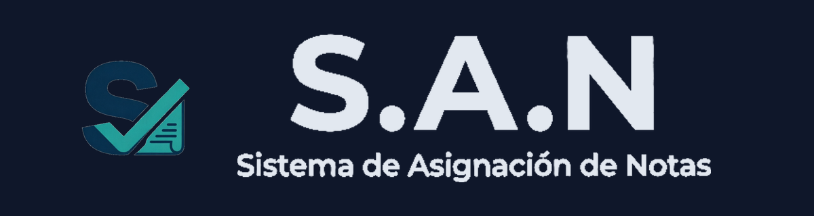

  

  <em>Una herramienta pensada para simplificar el registro de calificaciones y reducir el trabajo administrativo de los docentes.</em>

  
  
  
  
  

---

## ¿Qué es SAN?

SAN (Sistema de Asignación de Notas) es un proyecto personal cuyo objetivo es facilitar el registro y la organización de las calificaciones de los estudiantes.

Nace como una solución sencilla para aquellos docentes que aún realizan el registro de notas de manera manual o que necesitan una forma más rápida y organizada de administrar la información de sus estudiantes sin depender de plataformas complejas.

La filosofía de SAN es simple:

> El profesor debe dedicar más tiempo a enseñar y menos tiempo a calcular, organizar o buscar notas.

---

## ¿Por qué nació SAN?

La idea surgió a partir de una necesidad real.

Un familiar, docente de primaria, necesitaba una forma práctica de registrar las calificaciones de su salón y consultarlas fácilmente tanto desde su computador como desde su teléfono.

Como primera solución se desarrolló una aplicación en HTML que podía abrirse directamente desde un navegador. Aunque cumplió su propósito inicialmente, con el tiempo comenzaron a aparecer limitaciones relacionadas con la compatibilidad entre dispositivos y la facilidad de uso.

Por esta razón nació SAN, con el objetivo de convertirse en una aplicación independiente que pueda ejecutarse como una aplicación de escritorio y como una aplicación móvil, manteniendo la misma simplicidad de uso.

> Los prototipos y los intentos de empaquetado previos a la versión actual quedaron documentados en **[docs/historia](docs/historia/README.md)**.

---

## Funcionalidades

* Registro de notas por estudiante, materia y periodo académico.
* Cálculo automático de promedios por materia y promedio global por estudiante.
* Panel de resumen con el rendimiento general del grupo.
* Materias, estudiantes y periodos ("casillas") totalmente personalizables.
* Anotaciones por evaluación.
* Todo se guarda localmente en el dispositivo (`localStorage`) — sin necesidad de servidor ni conexión a internet.
* Disponible como app web (instalable como PWA, con funcionamiento offline), de escritorio (Windows) y móvil (Android).

---

## Tecnología

| Capa | Tecnología |
|---|---|
| UI | React 18 + Tailwind CSS |
| Build | Vite 5 |
| Escritorio | Electron (`SAN.exe`) |
| Móvil | Capacitor (`SAN.apk`, Android) |

## Compilar el proyecto

`SAN.exe` y `SAN.apk` se generan automáticamente con GitHub Actions al crear un tag de versión — no hace falta Wine ni Android SDK instalados a mano. Los pasos para instalar dependencias, el pipeline de CI y el build local/manual —incluyendo la configuración de firma de Android y los problemas de build ya resueltos— están documentados en **[BUILD.md](BUILD.md)**.

---

## Objetivo

Desarrollar una aplicación que permita al docente registrar las calificaciones de sus estudiantes de forma rápida, organizada y segura, automatizando los cálculos necesarios y reduciendo el tiempo dedicado a tareas administrativas.

## ¿A quién está dirigido?

Actualmente SAN está pensado principalmente para docentes de cualquier nivel educativo.

Aunque el profesor es el usuario principal, los estudiantes también se benefician indirectamente, ya que un registro organizado permite ofrecer mayor transparencia sobre las calificaciones, sus promedios y las observaciones asociadas a cada evaluación.

## ¿Qué busca resolver?

SAN pretende solucionar problemas cotidianos como:

* Registro manual de calificaciones en hojas de papel.
* Pérdida o desorganización de la información.
* Cálculo manual de promedios.
* Dificultad para consultar rápidamente las notas de un estudiante.
* Tiempo excesivo dedicado a tareas administrativas.

---

## Principios del proyecto

Durante todo el desarrollo del proyecto se buscará mantener estos principios:

* Simplicidad por encima de la complejidad.
* Interfaz intuitiva para docentes de cualquier edad.
* Automatización de tareas repetitivas.
* Organización clara de la información.
* Rapidez en el registro de calificaciones.
* Independencia de servicios externos cuando sea posible.
* Facilidad para evolucionar el proyecto en el futuro.

---

## Estado del proyecto

Actualmente SAN es un proyecto personal desarrollado para resolver una necesidad real.

El objetivo inicial no es competir con plataformas académicas existentes, sino construir una herramienta práctica, estable y fácil de utilizar que pueda convertirse en una solución confiable para el trabajo diario de un docente.

Una vez este primer objetivo esté completamente resuelto, el proyecto podrá evolucionar incorporando nuevas funcionalidades según las necesidades que vayan surgiendo.

---

## Filosofía

SAN no pretende ser un sistema complejo.

Pretende ser una herramienta que el profesor pueda abrir, utilizar durante su clase y cerrar al finalizar la jornada sin necesidad de configuraciones complicadas ni procesos innecesarios.

La tecnología debe simplificar el trabajo del docente, no hacerlo más difícil.

---

## Autor

**Sebastián Sánchez Chacón**

Proyecto desarrollado como iniciativa personal para facilitar el trabajo diario de los docentes mediante herramientas tecnológicas simples, prácticas y enfocadas en las necesidades reales del aula.

---

<em>"La enseñanza requiere tiempo. Registrar notas no debería quitárselo al docente."</em>

